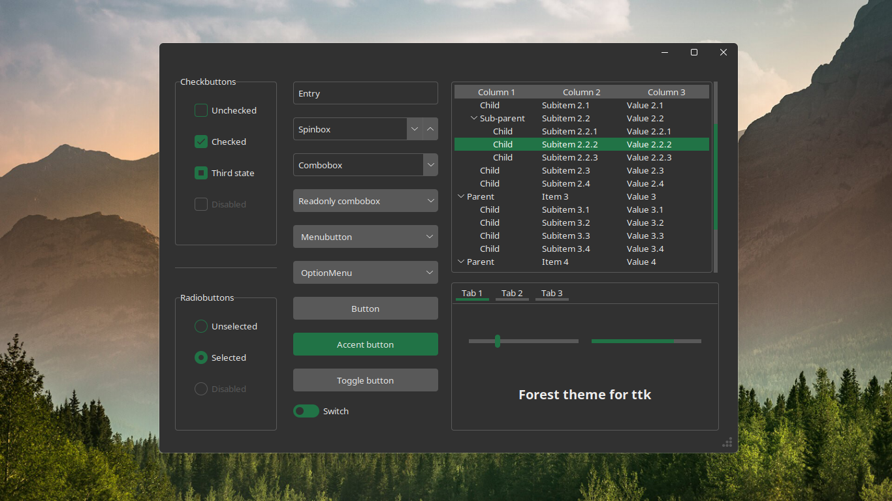
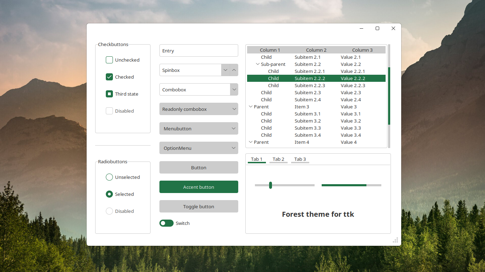

<<<<<<< HEAD
# book_data_management
=======
# Book Data Management System

書籍データを管理するためのシンプルなGUIアプリケーションです。

## 機能

- 書籍データの追加と表示
- ダーク/ライトテーマの切り替え
- Excelファイルでのデータ保存

## 使用方法

1. `main.py`を実行します
2. GUIが起動し、書籍データを入力できます
3. データはExcelファイルに自動保存されます

## 必要なパッケージ

- tkinter
- openpyxl

## スクリーンショット

Tkinter-theme used: [Forest-ttk-theme](https://github.com/rdbende/Forest-ttk-theme)
>>>>>>> 7eecc00 (firest コミット)
